# How to use

## Main screen

When opening the program, the main screen is shown:

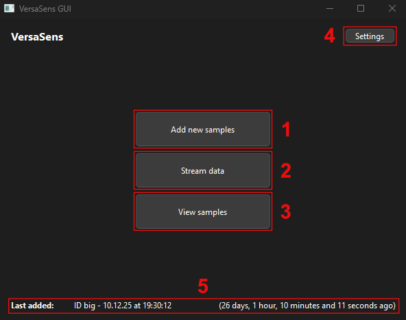

There are various buttons and elements on this screen:

1. Button to [import data into the program](#import-data).
2. Button to [stream live data from the VersaSens device](#stream-data).
3. Button to [view imported data](#view-imported-data).
4. Button to open the [settings window](#settings-window).
5. Information about the last imported data (may be out-of-date if recently imported).

## Import data

This window is used to import raw data files into the program's database.

The imported files are then processed and can be viewed in the program.
It is also possible to view the CSV and WAV files, alongside the given notes when
[manually browsing the database folder](#manually-browsing-the-database-folder).

The path to the database can be found in the settings window, or using the
"Open database folder" button in the ["View imported data"](#view-imported-data) window.

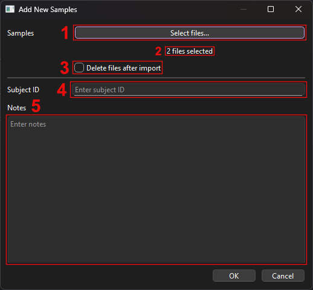

1. Button to select the files to import.
2. Text showing the number of files selected.
3. If checked, the original files are deleted after importing them into the program.
4. The ID of the subject corresponding to the files (e.g. "John Doe" or "Microphone test").
5. Optionally, notes to give regarding the files. They can later be found when viewing the imported data.

## Stream data

This window is used to stream live data from a VersaSens device.

After clicking the "Stop streaming" button or closing the window, a prompt similar to
the [data import window](#import-data) is shown to directly import the streamed data.
Clicking cancel on this prompt cancels the data import and deletes the streamed data.

When streaming, the raw data is stored in a temporary file inside the program's
database folder. In case an issue occurred during the data streaming, and no prompt was
shown to import the data, it is possible to manually import the temporary file if it
still exists via the [data import window](#import-data).

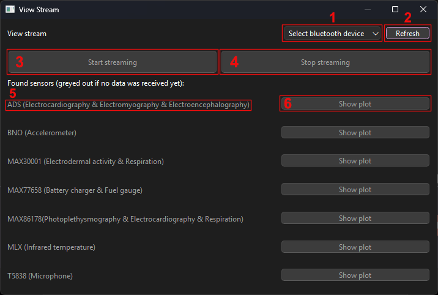

1. Menu to select a device from which to stream data, if VersaSens devices were found. If no device was found, clicking on the menu won't show anything.
2. Button to refresh the list of VersaSens devices.
3. Button to start streaming data. It is not clickable if no device was selected.
4. Button to stop streaming data. It is not clickable if the streaming isn't running.
5. The hardware name of the sensor, alongside a description. If the name is grayed out, the sensor hasn't streamed any data yet.
6. Button to show a real time [plot of the sensor's data](#plot-window). It is not clickable if the streaming hasn't started and no data was sent yet.

## View imported data

### List of subject IDs

The first window shows a list of subject IDs stored in the database.

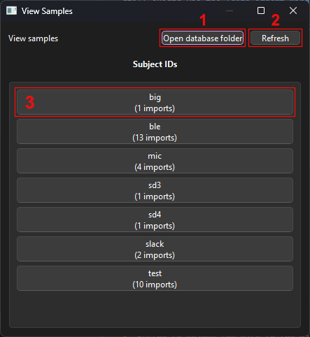

1. Button to open the program's database folder.
2. Button to refresh the list of imported subject IDs.
3. Button to [open the imports of the given subject ID](#list-of-imports-of-a-given-subject-id). It also shows the number of imports corresponding to the subject ID inside the program's database.

### List of imports of a given subject ID

This window shows a list of buttons corresponding to each import of the subject found
inside the program's database. Clicking on a button opens the
[information related to the import](#view-a-specific-import).

The button's label shows the date and time when the data was imported, and the number of
files that were imported.

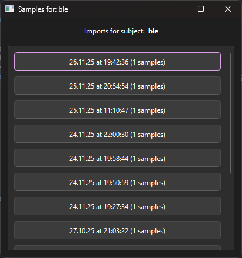

### View a specific import

This window shows the information regarding a specific import.

It contains:

- The subject's ID.
- The date and time of the import.
- The notes that were given when importing the data.
- A list of the imported files, alongside either a "No data found" label, or buttons to [open plots](#plot-window) corresponding to the sensors found inside the imported files.

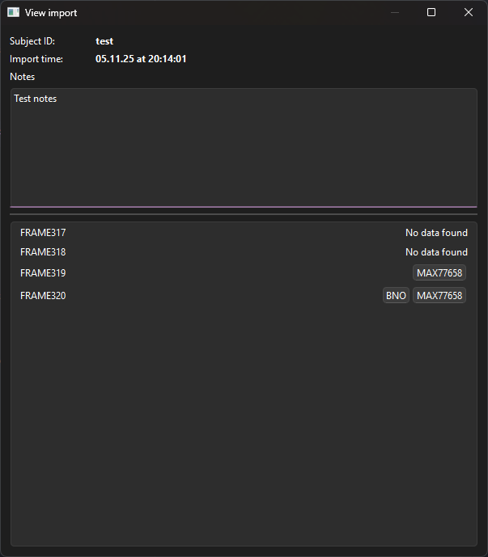

## Plot window

This window shows the plots corresponding to the chosen sensor.

Right-clicking the plot shows different options for bounds of the X and Y axes, and
different transformations that can be done on the data (e.g. Fast Fourier
Transformation, logarithm).

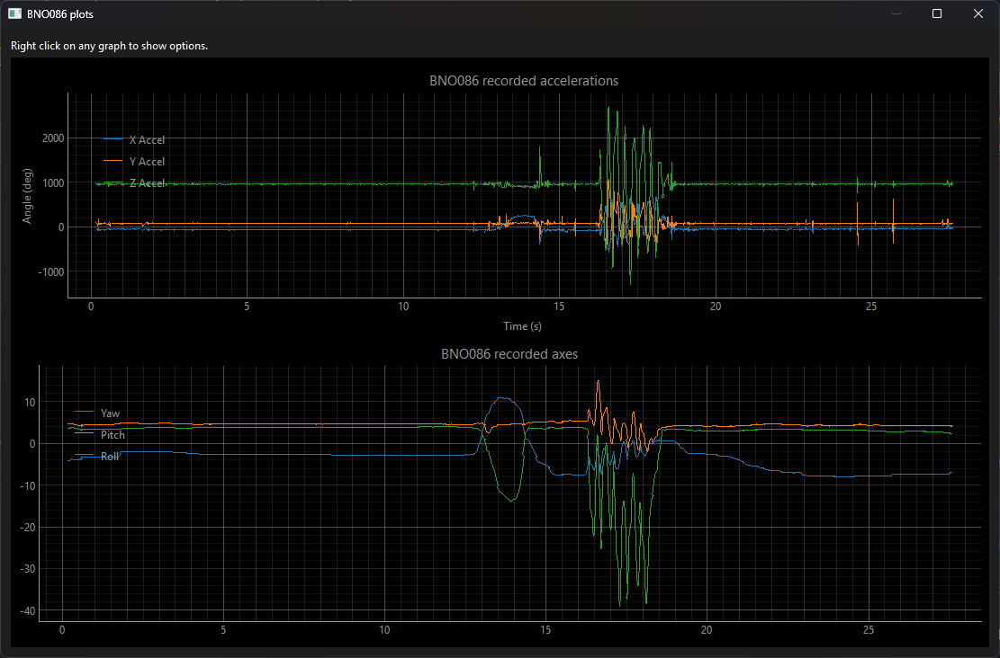

## Settings window

This window contains information about the configuration of the program, alongside
buttons to change these settings.

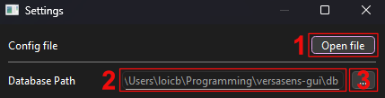

1. Button to directly open the file containing the settings of the program.
2. The current path to the program's database.
3. Button to change the path to the database.

## Manually browsing the database folder

### Root

The root of the database folder contains:

- Folders regrouping the data of each subject ID.
- Optionally, the raw files created, for instance, when streaming data.

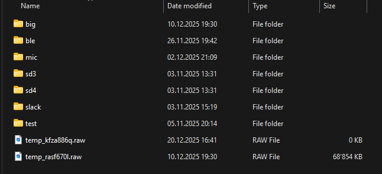

### Subject ID folder

A subject ID's folder contains:

- Folders corresponding to each import. They are named according to the date and time of the import (YYYY-MM-DDTHHMMSS or +Tz).

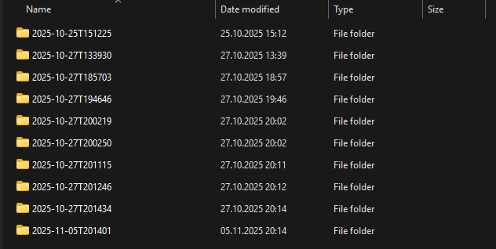

### Import folder

An import's folder contains:

- A `metadata.json` file containing the subject ID, the timestamp of the import and the given notes.
- Folders corresponding to each imported file.

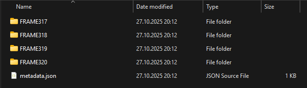

### Imported file folder

An imported file's folder contains:

- A `raw_data.txt` file containing the original raw data if needed.
- CSV files containing the processed data.
- If the microphone sensor's data was found in the raw data (T5838 sensor), a WAV file containing the audio data.

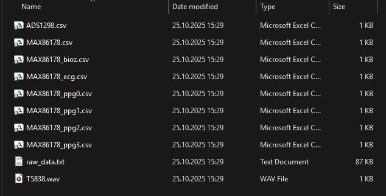
